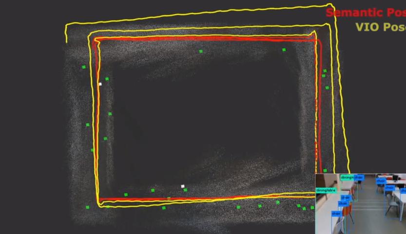
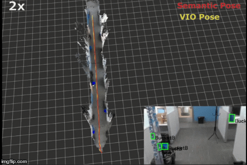

# Semantic SLAM #

This package can perform optimization of pose estimated from VO/VIO methods which tend to drift over time. It uses planar surfaces extracted from object detections in order to create a sparse semantic map of the environment, thus optimizing the drift of the VO/VIO algorithms.

### In order to run this package you will need two additional modules ###
- A VO/VIO algorithm: [ROVIO](https://github.com/ethz-asl/rovio), [VINS_MONO](https://github.com/HKUST-Aerial-Robotics/VINS-Mono), [OKVIS](https://github.com/ethz-asl/okvis) etc. 
- An Object Detector: [Yolo](https://github.com/leggedrobotics/darknet_ros), [Shape Color Detector](https://bitbucket.org/hridaybavle/bucket_detector)

Currently it can extract planar surfaces and create a semantic map from from the following objects:
- chair
- tvmonitor
- book
- keyboard
- laptop
- bucket
- car

### Related Paper: ###

**[VPS-SLAM: Visual Planar Semantic SLAM for Aerial Robotic Systems](https://ieeexplore.ieee.org/document/9045978)**, Hriday Bavle, Paloma de la Puente, Jonathan How, Pascual Campoy, Journal of IEEE Access.

### Video ###

<a href="https://vimeo.com/368217703" target="_blank"></a>

### How do I set it up? 

**First install g2o following these instructions (assuming ROS kinetic distribution):**

- sudo apt-get install ros-kinetic-libg2o
- sudo cp -r /opt/ros/kinetic/lib/libg2o_* /usr/local/lib
- sudo cp -r /opt/ros/kinetic/include/g2o /usr/local/include

**To try a simple example with pre-recorded VIO pose, a blue bucket detector:**

**Create a ros workspace and clone the following packages:**

- Download the rosbag: 
```    
    https://www.dropbox.com/s/jnywuvcn2m9ubu2/entire_lab_3_rounds.bag?dl=0   
```
- Create a workspace, clone the repo and compile:
```
    mkdir -p workspace/ros/semantic_slam_ws/src/ && cd workspace/ros/semantic_slam_ws/src/    
    git clone https://bitbucket.org/hridaybavle/semantic_slam.git && git clone  https://bitbucket.org/hridaybavle/bucket_detector.git   
    cd .. && catkin_make -DCMAKE_BUILD_TYPE=Release
```    
- Insert the rosbag location in the launcher
```
    gedit src/semantic_slam/launch/ps_slam_with_snap_pose_bucket_det_lab_data.launch 
```    
- Launch and visualize
```    
    source devel/setup.bash
    roslaunch semantic_slam ps_slam_with_snap_pose_bucket_det_lab_data.launch    
    rviz -d src/semantic_slam/rviz/graph_semantic_slam.rviz
```    



**Note: In the example above [voxblox](https://github.com/ethz-asl/voxblox) is used for mapping. 

### Subsribed Topics 

- **/SQ04/snap_vislam/vislam/pose** ([geometry_msgs/PoseStamped](http://docs.ros.org/api/geometry_msgs/html/msg/PoseStamped.html))  
The default snapdragon VIO pose published in NED in frame. This message can be remapped remapped to any other VO pose message publishing in NED frame. ([See frame conventions](https://en.wikipedia.org/wiki/Axes_conventions))


- **/rovio/odometry** ([geometry_msgs/PoseStamped](http://docs.ros.org/melodic/api/nav_msgs/html/msg/Odometry.html))  
The VIO odometry published in ENU frame. Can be remapped to the desired topic name in the launcher. 


- **/depth_registered/points** ([sensor_msgs/PointCloud2](http://docs.ros.org/melodic/api/sensor_msgs/html/msg/PointCloud2.html)) 
The point cloud required for planar surface extraction. 


- **/darknet_ros/bounding_boxes**([darknet_msgs_ros/BoundingBoxes](https://github.com/leggedrobotics/darknet_ros))  
The detection bounding boxes published by yolo if using the yolo detector ros package. 

- **/image_processed/bounding_boxes**([ShapeColor_ObjectDetection/DetectedObjects](https://hridaybavle@bitbucket.org/hridaybavle/bucket_detector.git))
The detection bounding boxes if using the bucket detector. It can be downloaded from the link above. 


### Published Topics

- **robot_pose**([geometry_msgs/PoseStamped](http://docs.ros.org/melodic/api/nav_msgs/html/msg/Odometry.html)) 
The pose of the robot estimated by the algo.

- **robot_path**([nav_msgs/Path](http://docs.ros.org/melodic/api/nav_msgs/html/msg/Path.html))  
The path of the robot psoe for visualization.

- **keyframe_poses**([geometry_msgs/PoseArray](http://docs.ros.org/melodic/api/geometry_msgs/html/msg/PoseArray.html))  
The poses of the keyframe being added to the g2o graph.

- **mapped_landmarks**([visualization_msgs/MarkerArray](http://docs.ros.org/melodic/api/visualization_msgs/html/msg/MarkerArray.html))  
The mapped semantic planar surfaces.

- **detected_landmarks**([visualization_msgs/MarkerArray](http://docs.ros.org/melodic/api/visualization_msgs/html/msg/MarkerArray.html))  
The detected landmarks in the current frame. 

The configurations of the algorithms can be found inside the cfg folder in order to be changed accordingly.


